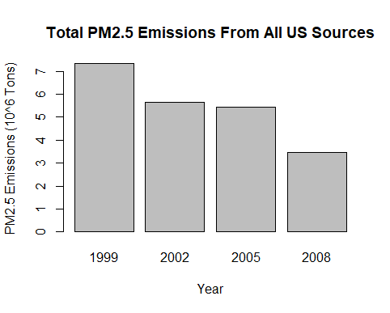
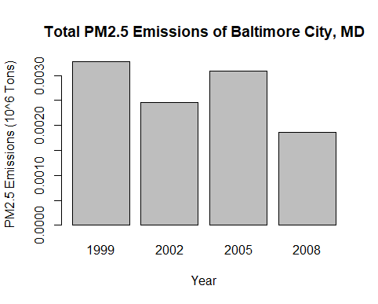
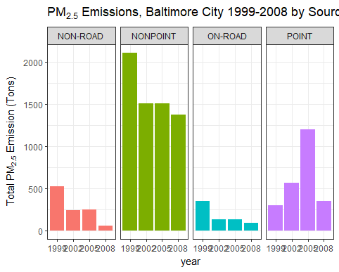
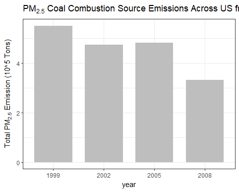
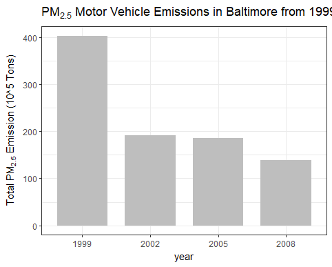
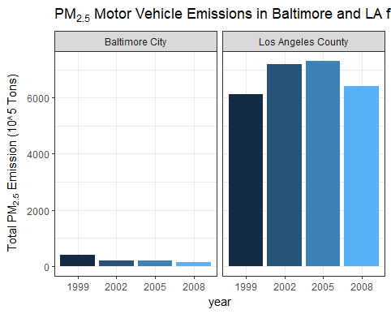

## Introduction

Fine particulate matter (PM2.5) is an ambient air pollutant for which there is strong evidence that it is harmful to human health. In the United States, the Environmental Protection Agency (EPA) is tasked with setting national ambient air quality standards for fine PM and for tracking the emissions of this pollutant into the atmosphere. Approximatly every 3 years, the EPA releases its database on emissions of PM2.5. This database is known as the National Emissions Inventory (NEI). You can read more information about the NEI at the [EPA National Emissions Inventory web site](http://www.epa.gov/ttn/chief/eiinformation.html).

For each year and for each type of PM source, the NEI records how many tons of PM2.5 were emitted from that source over the course of the entire year. The data that you will use for this assignment are for 1999, 2002, 2005, and 2008.

## Review criteria
 
For each question

 * Does the plot appear to address the question being asked?
 * Is the submitted R code appropriate for construction of the submitted plot?

## Data 

The data for this assignment are available from the course web site as a single zip file:

 * [Data for Peer Assessment (29MB)](https://d396qusza40orc.cloudfront.net/exdata%2Fdata%2FNEI_data.zip)

The zip file contains two files:

PM2.5 Emissions Data (summarySCC_PM25.rds): This file contains a data frame with all of the PM2.5 emissions data for 1999, 2002, 2005, and 2008. For each year, the table contains number of tons of PM2.5 emitted from a specific type of source for the entire year. Here are the first few rows.

```R
##     fips      SCC Pollutant Emissions  type year
## 4  09001 10100401  PM25-PRI    15.714 POINT 1999
## 8  09001 10100404  PM25-PRI   234.178 POINT 1999
## 12 09001 10100501  PM25-PRI     0.128 POINT 1999
## 16 09001 10200401  PM25-PRI     2.036 POINT 1999
## 20 09001 10200504  PM25-PRI     0.388 POINT 1999
## 24 09001 10200602  PM25-PRI     1.490 POINT 1999
```

 * fips: A five-digit number (represented as a string) indicating the U.S. county
 * SCC: The name of the source as indicated by a digit string (see source code classification table)
 * Pollutant: A string indicating the pollutant
 * Emissions: Amount of PM2.5 emitted, in tons
 * type: The type of source (point, non-point, on-road, or non-road)
 * year: The year of emissions recorded

Source Classification Code Table (Source_Classification_Code.rds): This table provides a mapping from the SCC digit strings in the Emissions table to the actual name of the PM2.5 source. The sources are categorized in a few different ways from more general to more specific and you may choose to explore whatever categories you think are most useful. For example, source “10100101” is known as “Ext Comb /Electric Gen /Anthracite Coal /Pulverized Coal”.

You can read each of the two files using the readRDS() function in R. For example, reading in each file can be done with the following code:


```R
## This first line will likely take a few seconds. Be patient!
NEI <- readRDS("summarySCC_PM25.rds")
SCC <- readRDS("Source_Classification_Code.rds")
```

as long as each of those files is in your current working directory (check by calling dir() and see if those files are in the listing).


## Assignment 
The overall goal of this assignment is to explore the National Emissions Inventory database and see what it say about fine particulate matter pollution in the United states over the 10-year period 1999–2008. You may use any R package you want to support your analysis.

### Questions

You must address the following questions and tasks in your exploratory analysis. For each question/task you will need to make a single plot. Unless specified, you can use any plotting system in R to make your plot.

 1. Have total emissions from PM2.5 decreased in the United States from 1999 to 2008? Using the base plotting system, make a plot showing the total PM2.5 emission from all sources for each of the years 1999, 2002, 2005, and 2008.
 2. Have total emissions from PM2.5 decreased in the Baltimore City, Maryland (fips == "24510") from 1999 to 2008? Use the base plotting system to make a plot answering this question.
 3. Of the four types of sources indicated by the type (point, nonpoint, onroad, nonroad) variable, which of these four sources have seen decreases in emissions from 1999–2008 for Baltimore City? Which have seen increases in emissions from 1999–2008? Use the ggplot2 plotting system to make a plot answer this question.
 4. Across the United States, how have emissions from coal combustion-related sources changed from 1999–2008?
 5. How have emissions from motor vehicle sources changed from 1999–2008 in Baltimore City?
 6. Compare emissions from motor vehicle sources in Baltimore City with emissions from motor vehicle sources in Los Angeles County, California (fips == "06037"). Which city has seen greater changes over time in motor vehicle emissions?

### Making and Submitting Plots 
For each plot you should

 * Construct the plot and save it to a PNG file.
 * Create a separate R code file (plot1.R, plot2.R, etc.) that constructs the corresponding plot, i.e. code in plot1.R constructs the plot1.png plot. Your code file should include code for reading the data so that the plot can be fully reproduced. You must also include the code that creates the PNG file. Only include the code for a single plot (i.e. plot1.R should only include code for producing plot1.png)
 * Upload the PNG file on the Assignment submission page
 * Copy and paste the R code from the corresponding R file into the text box at the appropriate point in the peer assessment.
 
## Answer Set

### Data Prepartion
The following answers all depend on the PM2.5 Emmissions dataset. The following script is common in all script files.

#### Download the data
Source the file and unzip the contents
```R
# Download archive file, if it does not exist

if(!(file.exists("summarySCC_PM25.rds") && 
     file.exists("Source_Classification_Code.rds"))) { 
    
    fileName <- "NEI_data.zip"
    if(!file.exists(fileName)) {
        fileURL <- "https://d396qusza40orc.cloudfront.net/exdata%2Fdata%2FNEI_data.zip"
        download.file(url=fileURL,destfile=fileName,mode="wb")
    }  
    unzip(dataFile) 
}
```
#### Load the NEI and SCC data frames
```R
NEIdata <- readRDS("summarySCC_PM25.rds")
SCCdata <- readRDS("Source_Classification_Code.rds")
```
#### Take a peek at the contents
```R
head(NEIdata)

    fips      SCC Pollutant Emissions  type year
4  09001 10100401  PM25-PRI    15.714 POINT 1999
8  09001 10100404  PM25-PRI   234.178 POINT 1999
12 09001 10100501  PM25-PRI     0.128 POINT 1999
16 09001 10200401  PM25-PRI     2.036 POINT 1999
20 09001 10200504  PM25-PRI     0.388 POINT 1999
24 09001 10200602  PM25-PRI     1.490 POINT 1999

str(NEIdata)

'data.frame':	6497651 obs. of  6 variables:
 $ fips     : chr  "09001" "09001" "09001" "09001" ...
 $ SCC      : chr  "10100401" "10100404" "10100501" "10200401" ...
 $ Pollutant: chr  "PM25-PRI" "PM25-PRI" "PM25-PRI" "PM25-PRI" ...
 $ Emissions: num  15.714 234.178 0.128 2.036 0.388 ...
 $ type     : chr  "POINT" "POINT" "POINT" "POINT" ...
 $ year     : int  1999 1999 1999 1999 1999 1999 1999 1999 1999 1999 ...
```

```R
head(SCCdata)

       SCC Data.Category
1 10100101         Point
2 10100102         Point
3 10100201         Point
4 10100202         Point
5 10100203         Point
6 10100204         Point
                                                                  Short.Name
1                   Ext Comb /Electric Gen /Anthracite Coal /Pulverized Coal
2 Ext Comb /Electric Gen /Anthracite Coal /Traveling Grate (Overfeed) Stoker
3       Ext Comb /Electric Gen /Bituminous Coal /Pulverized Coal: Wet Bottom
4       Ext Comb /Electric Gen /Bituminous Coal /Pulverized Coal: Dry Bottom
5                   Ext Comb /Electric Gen /Bituminous Coal /Cyclone Furnace
6                   Ext Comb /Electric Gen /Bituminous Coal /Spreader Stoker
                               EI.Sector Option.Group Option.Set
1 Fuel Comb - Electric Generation - Coal                        
2 Fuel Comb - Electric Generation - Coal                        
3 Fuel Comb - Electric Generation - Coal                        
4 Fuel Comb - Electric Generation - Coal                        
5 Fuel Comb - Electric Generation - Coal                        
6 Fuel Comb - Electric Generation - Coal                        
                SCC.Level.One       SCC.Level.Two
1 External Combustion Boilers Electric Generation
2 External Combustion Boilers Electric Generation
3 External Combustion Boilers Electric Generation
4 External Combustion Boilers Electric Generation
5 External Combustion Boilers Electric Generation
6 External Combustion Boilers Electric Generation
                SCC.Level.Three
1               Anthracite Coal
2               Anthracite Coal
3 Bituminous/Subbituminous Coal
4 Bituminous/Subbituminous Coal
5 Bituminous/Subbituminous Coal
6 Bituminous/Subbituminous Coal
                                 SCC.Level.Four Map.To
1                               Pulverized Coal     NA
2             Traveling Grate (Overfeed) Stoker     NA
3 Pulverized Coal: Wet Bottom (Bituminous Coal)     NA
4 Pulverized Coal: Dry Bottom (Bituminous Coal)     NA
5             Cyclone Furnace (Bituminous Coal)     NA
6             Spreader Stoker (Bituminous Coal)     NA
  Last.Inventory.Year Created_Date Revised_Date Usage.Notes
1                  NA                                      
2                  NA                                      
3                  NA                                      
4                  NA                                      
5                  NA                                      
6                  NA

str(SCCdata)

'data.frame':	11717 obs. of  15 variables:
 $ SCC                : Factor w/ 11717 levels "10100101","10100102",..: 1 2 3 4 5 6 7 8 9 10 ...
 $ Data.Category      : Factor w/ 6 levels "Biogenic","Event",..: 6 6 6 6 6 6 6 6 6 6 ...
 $ Short.Name         : Factor w/ 11238 levels "","2,4-D Salts and Esters Prod /Process Vents, 2,4-D Recovery: Filtration",..: 3283 3284 3293 3291 3290 3294 3295 3296 3292 3289 ...
 $ EI.Sector          : Factor w/ 59 levels "Agriculture - Crops & Livestock Dust",..: 18 18 18 18 18 18 18 18 18 18 ...
 $ Option.Group       : Factor w/ 25 levels "","C/I Kerosene",..: 1 1 1 1 1 1 1 1 1 1 ...
 $ Option.Set         : Factor w/ 18 levels "","A","B","B1A",..: 1 1 1 1 1 1 1 1 1 1 ...
 $ SCC.Level.One      : Factor w/ 17 levels "Brick Kilns",..: 3 3 3 3 3 3 3 3 3 3 ...
 $ SCC.Level.Two      : Factor w/ 146 levels "","Agricultural Chemicals Production",..: 32 32 32 32 32 32 32 32 32 32 ...
 $ SCC.Level.Three    : Factor w/ 1061 levels "","100% Biosolids (e.g., sewage sludge, manure, mixtures of these matls)",..: 88 88 156 156 156 156 156 156 156 156 ...
 $ SCC.Level.Four     : Factor w/ 6084 levels "","(NH4)2 SO4 Acid Bath System and Evaporator",..: 4455 5583 4466 4458 1341 5246 5584 5983 4461 776 ...
 $ Map.To             : num  NA NA NA NA NA NA NA NA NA NA ...
 $ Last.Inventory.Year: int  NA NA NA NA NA NA NA NA NA NA ...
 $ Created_Date       : Factor w/ 57 levels "","1/27/2000 0:00:00",..: 1 1 1 1 1 1 1 1 1 1 ...
 $ Revised_Date       : Factor w/ 44 levels "","1/27/2000 0:00:00",..: 1 1 1 1 1 1 1 1 1 1 ...
 $ Usage.Notes        : Factor w/ 21 levels ""," ","includes bleaching towers, washer hoods, filtrate tanks, vacuum pump exhausts",..: 1 1 1 1 1 1 1 1 1 1 ...  
```

#### Load the packages that we'll need for plotting
```R
library(ggplot2)
library(plyr)
```
### Answer the questions
#### Question 1: Have total emissions from PM2.5 decreased in the United States from 1999 to 2008?
Using the base plotting system, make a plot showing the total PM2.5 emission from all sources for each of the years 1999, 2002, 2005, and 2008.

Aggregate the data
```R
emmissionsTotal <- aggregate(Emissions ~ year, NEIdata, sum)
head(emmissionsTotal)
```
Plot the data using a base plotting system
```R
barplot(
  (emmissionsTotal$Emissions)/10^6,
  names.arg=emmissionsTotal$year,
  xlab="Year",
  ylab="PM2.5 Emissions (10^6 Tons)",
  main="Total PM2.5 Emissions From All US Sources"
)
```


Answer #1: As per the plot, there is a downward trend of PM2.5 emissions from 1999 to 2008

#### Question 2: Have total emissions from PM2.5 decreased in the Baltimore City, Maryland (fips == “24510”) from 1999 to 2008? 
Use the base plotting system to make a plot answering this question.

Subset the data first, and then aggregate the emissions by year
```R
NEIdataBaltimore<-subset(NEIdata, fips == "24510")
emmissionsBaltimore <- aggregate(Emissions ~ year, NEIdataBaltimore, sum)
head(emmissionsBaltimore)
```
Plot the data using a base plotting system
```R
barplot(
  (emmissionsBaltimore$Emissions)/10^6,
  names.arg=emmissionsBaltimore$year,
  xlab="Year",
  ylab="PM2.5 Emissions (10^6 Tons)",
  main="Total PM2.5 Emissions for Baltimore City, MD"
)
```


Answer #2: As per the plot, while there is a overall downward trend of PM2.5 emissions from 1999 to 2008, there was a spike in 2005.


#### Question 3: Of the four types of sources indicated by the type (point, nonpoint, onroad, nonroad) variable, which of these four sources have seen decreases in emissions from 1999-2008 for Baltimore City?
Which have seen increases in emissions from 1999-2008? Use the ggplot2 plotting system to make a plot answer this question.

Subset the data by Baltimore City, and aggregate the emissions by year
```R
NEIdataBaltimore<-subset(NEIdata, fips == "24510")
emmissionsBaltimore <- aggregate(Emissions ~ year, NEIdataBaltimore, sum)
```
Facet Plot by Type
```R
#Plot the graph
ggp <- ggplot(NEIdataBaltimore,aes(factor(year),Emissions,fill=type)) +
    geom_bar(stat="identity") +
    theme_bw() + guides(fill=FALSE)+
    facet_grid(.~type,scales = "free",space="free") + 
    labs(x="year", y=expression("Total PM"[2.5]*" Emission (Tons)")) + 
    labs(title=expression("PM"[2.5]*" Emissions, Baltimore City 1999-2008 by Source Type"))

print(ggp)
```


Answer #3: As per the plot, Non-Road, Non-Point, and On-Road types have seen decreases in Baltimore City between 1999 and 2008. Point emmisions have overall increased during this period, with a spike in 2005, and an eventual decrease in 2008, but still higher than first baselined in 1999.

#### Question 4: Across the United States, how have emissions from coal combustion-related sources changed from 1999–2008?

Subset the data Source (SCC) data by combusition entries and coal entries
```R
#Get the combustion entries from the Level One attribute
combustionEntries <- grepl("comb", SCCdata$SCC.Level.One, ignore.case=TRUE)

#Get the coal entries from theLevel Four attribute
coalEntries <- grepl("coal", SCCdata$SCC.Level.Four, ignore.case=TRUE) 

#Xref the two sets to find the common entries that are both coal and combustion
coalCombustionEntries <- (combustionEntries & coalEntries)

#Get the monitor # of the common entries
coalCombustionSCC <- SCCdata[coalCombustionEntries,]$SCC
```

Xref to the NEI data to get the rows (readings) matching the SCC
```R
coalCombustionNEI <- NEIdata[NEIdata$SCC %in% coalCombustionSCC,]
```
Histogram Plot
```R
#plot the graph
ggp <- ggplot(coalCombustionNEI,aes(factor(year),Emissions/10^5)) +
    geom_bar(stat="identity",fill="grey",width=0.75) +
    theme_bw() +  guides(fill=FALSE) +
    labs(x="year", y=expression("Total PM"[2.5]*" Emission (10^5 Tons)")) + 
    labs(title=expression("PM"[2.5]*" Coal Combustion Source Emissions Across US from 1999-2008"))

print(ggp)
```


Answer #4: As per the plot, coal combustible sources have generally decreased from 1999 to 2008. There was a decrease from 1999 to 2002, but plateaued to 2005, and began to decrease again afterwards to 2008.

#### Question 5: How have emissions from motor vehicle sources changed from 1999–2008 in Baltimore City?

Subset the data by motor vehicles in SCC.Level.Two
```R
vehicles <- grep("vehicle", SCCdata$SCC.Level.Two, ignore.case=TRUE)
vehiclesSCC <- SCCdata[vehicles,]$SCC
vehiclesNEI <- NEIdata[NEIdata$SCC %in% vehiclesSCC,]
```


Subset the data by Baltimore City, and aggregate the emissions by year
```R
VehicleNEIdataBaltimore<-vehiclesNEI[vehiclesNEI$fips=="24510",]
```

Histogram Plot
```R
#plot the graph
ggp <- ggplot(VehicleNEIdataBaltimore,aes(factor(year),Emissions)) +
    geom_bar(stat="identity",fill="grey",width=0.75) +
    theme_bw() +  guides(fill=FALSE) +
    labs(x="year", y=expression("Total PM"[2.5]*" Emission (10^5 Tons)")) + 
    labs(title=expression("PM"[2.5]*" Motor Vehicle Emissions in Baltimore from 1999-2008"))

print(ggp)
```


Answer #5: As per the plot, motor vehicle sources have generally decreased from 1999 to 2008. There was a decrease from 1999 to 2002, but plateaued to 2005, and began to decrease again afterwards to 2008.

#### Question 6: Compare emissions from motor vehicle sources in Baltimore City with emissions from motor vehicle sources in Los Angeles County, California (fips == “06037”). Which city has seen greater changes over time in motor vehicle emissions?

Subset the Emissions data from Baltimore City and add column to capture city name
```R
VehicleNEIdataBaltimore<-vehiclesNEI[vehiclesNEI$fips=="24510",]
VehicleNEIdataBaltimore$city <- "Baltimore City"
```

Subset the Emissions data from LA and add column to capture city name
```R
VehicleNEIdataLosAngeles<-vehiclesNEI[vehiclesNEI$fips=="06037",]
VehicleNEIdataLosAngeles$city <- "Los Angeles County"
```

Combine both datasets
```R
NEIBaltimoreAndLosAngeles <- rbind(VehicleNEIdataBaltimore, VehicleNEIdataLosAngeles)
```

Create a Facet Plot to compare the cities
```R
#plot the graph
ggp <- ggplot(NEIBaltimoreAndLosAngeles,aes(x=factor(year),y=Emissions, fill=city)) +
    geom_bar(stat="identity",aes(fill=year)) +
    facet_grid(~city) +
    theme_bw() +  guides(fill=FALSE) +
    labs(x="year", y=expression("Total PM"[2.5]*" Emission (10^5 Tons)")) + 
    labs(title=expression("PM"[2.5]*" Motor Vehicle Emissions in Baltimore and LA from 1999-2008"))

print(ggp)
```


Answer #6: As per the plot, LA has seen a greater magnitude of motor vehicle emmission change compared to Baltimore City between 1999 and 2008
